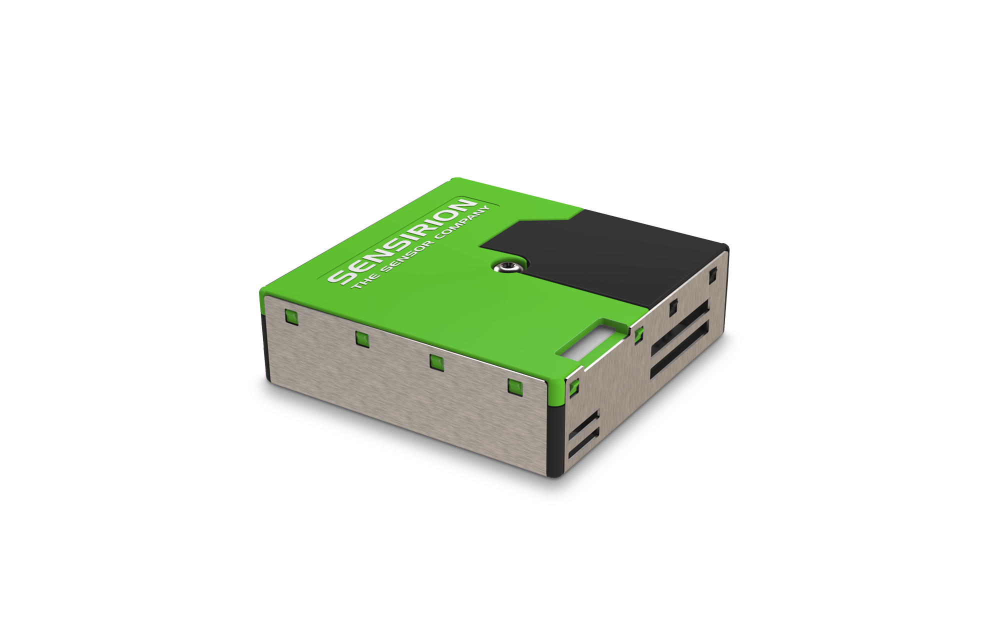
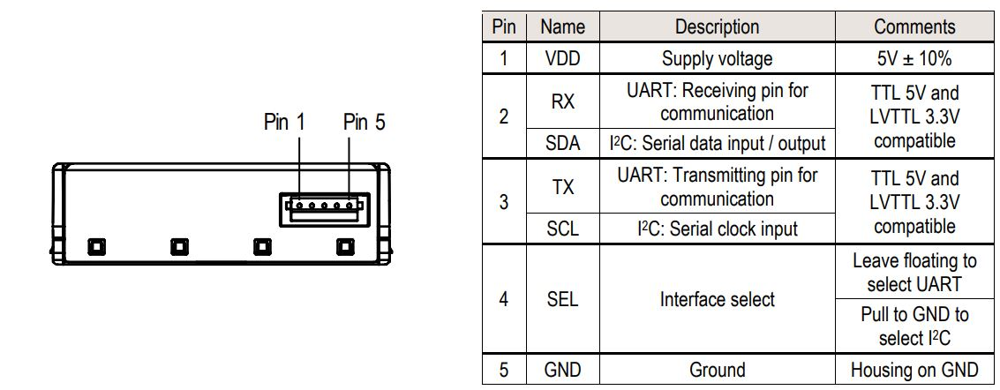
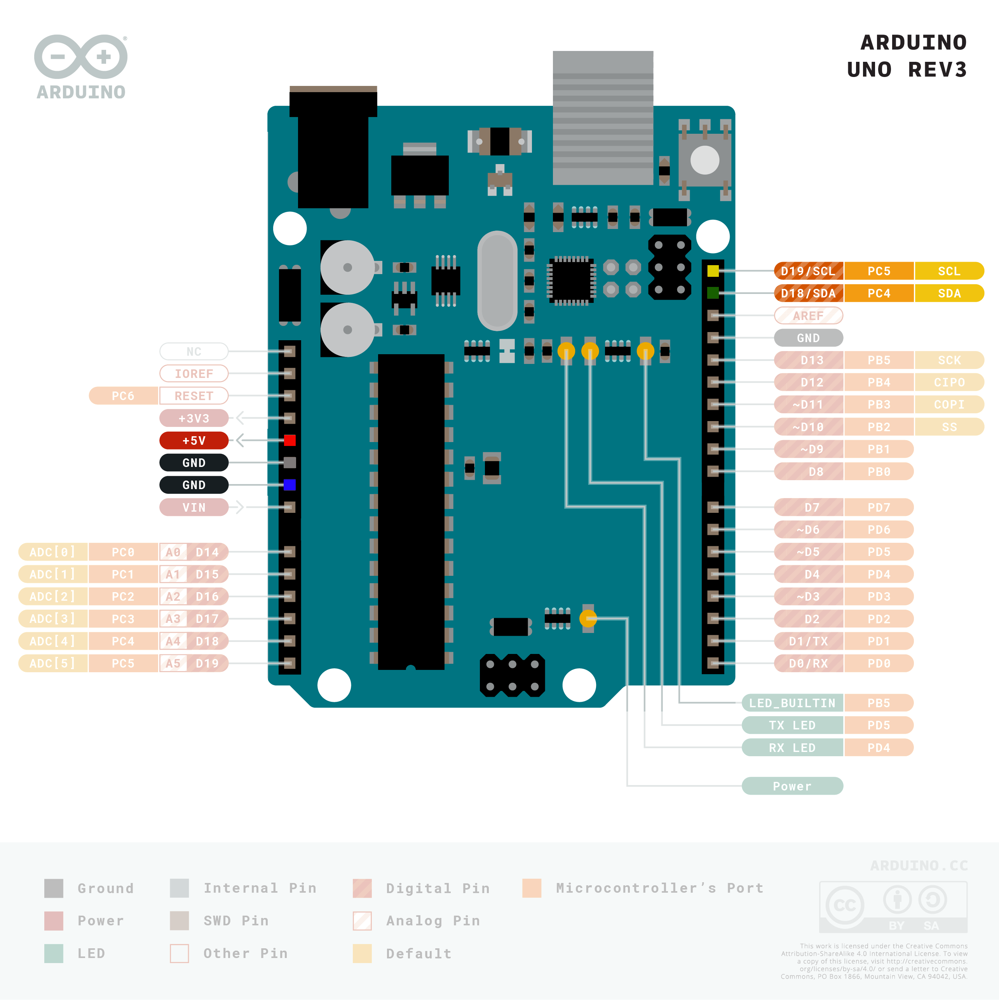
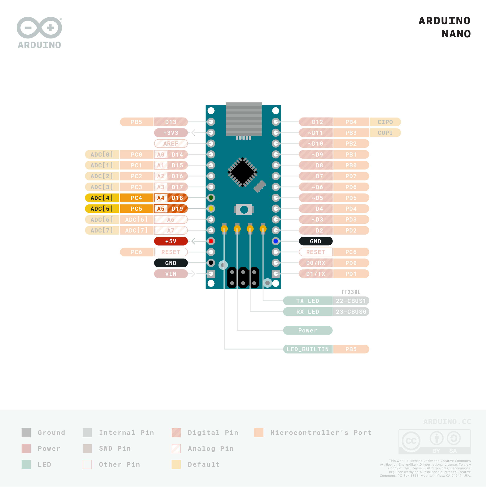
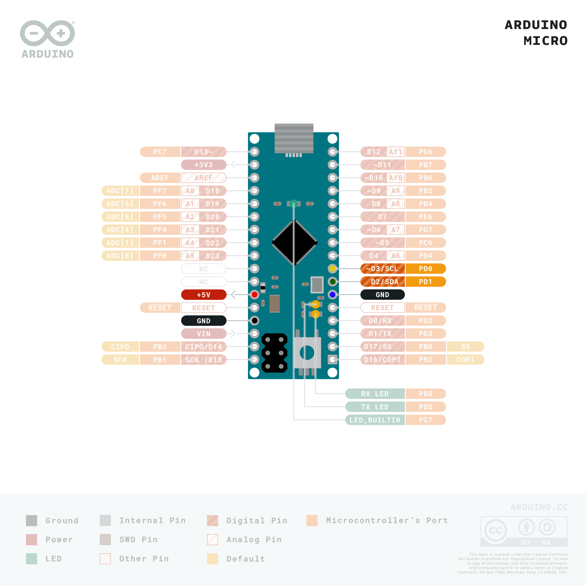
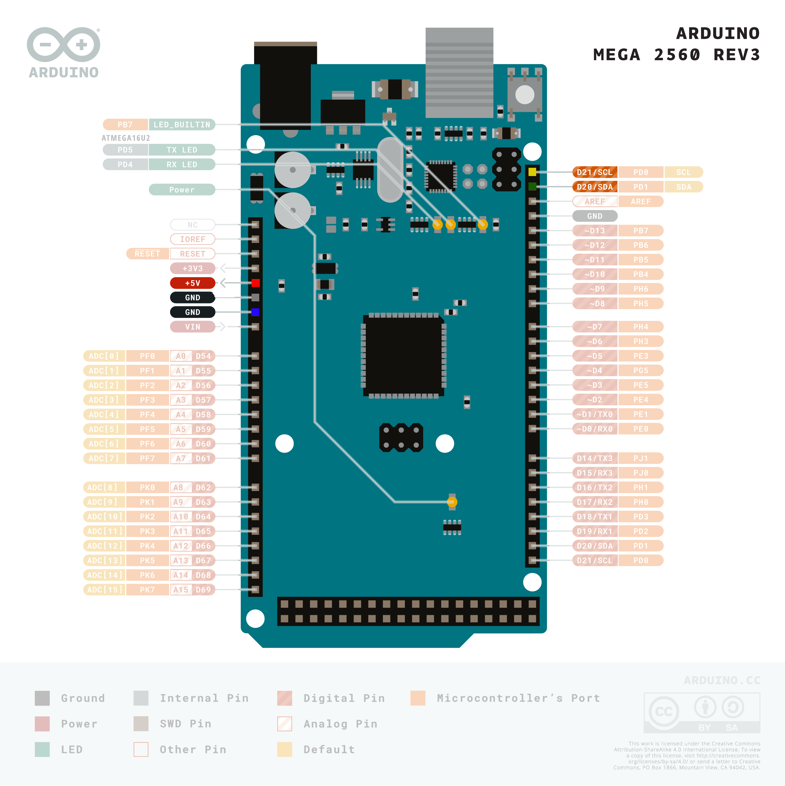
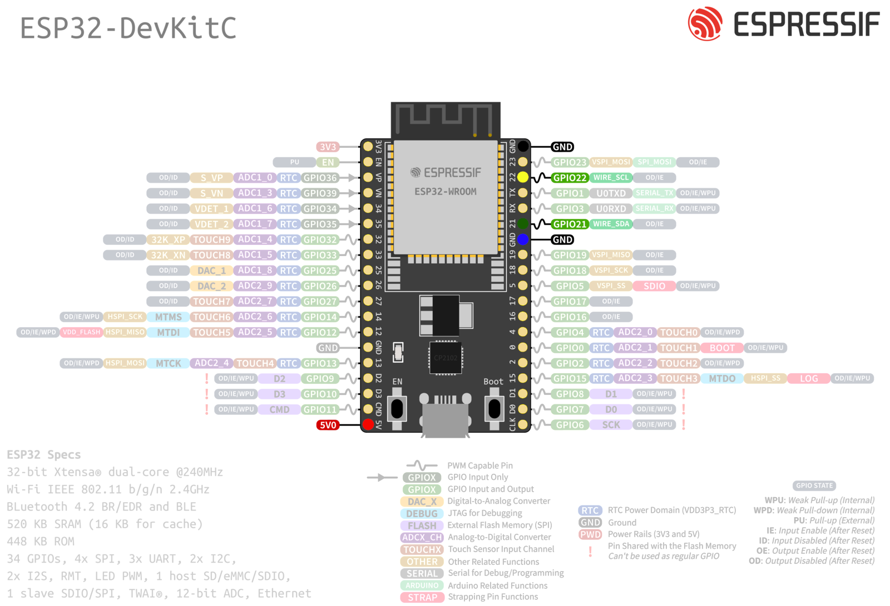

# Sensirion I²C SPS30 Arduino Library

This is the Sensirion SPS30 library for Arduino allowing you to
communicate with a SPS30 sensor
over I²C.



Click [here](https://sensirion.com/products/catalog/SPS30) to learn more about the Sensirion SPS30 sensor.


Not all sensors of this driver family support all measurements.
In case a measurement is not supported by all sensors, the products that
support it are listed in the API description.


The default I²C address of [SPS30](https://sensirion.com/products/catalog/SPS30) is **0x69**.


## Installation of the library

This library can be installed using the Arduino Library manager:
Start the [Arduino IDE](http://www.arduino.cc/en/main/software) and open
the Library Manager via

`Sketch` ➔ `Include Library` ➔ `Manage Libraries...`

Search for the `Sensirion I2C SPS30` library in the `Filter
your search...` field and install it by clicking the `install` button.

If you cannot find it in the library manager, download the latest release as .zip file
and add it to your [Arduino IDE](http://www.arduino.cc/en/main/software) via

`Sketch` ➔ `Include Library` ➔ `Add .ZIP Library...`

Don't forget to **install the dependencies** listed below the same way via library
manager or `Add .ZIP Library`

#### Dependencies
* [Sensirion Core](https://github.com/Sensirion/arduino-core)

## Connect the sensor

Use the following pin description to connect your SPS30 to the standard I²C bus of your Arduino board:



| *Pin* | *Cable Color* | *Name* | *Description*  | *Comments* |
|-------|---------------|:------:|----------------|------------|
| 1 | red | VDD | Supply Voltage | 5V
| 2 | green | SDA | I2C: Serial data input / output |
| 3 | yellow | SCL | I2C: Serial clock input |
| 4 | blue | SEL | Interface select | Pull to GND to select I2C
| 5 | black | GND | Ground |


The recommended voltage is 5V.

### Board specific wiring
You will find pinout schematics for recommended board models below:


<details><summary>Arduino Uno</summary>
<p>

| *SPS30* | *SPS30 Pin* | *Cable Color* | *Board Pin* |
| :---: | --- | --- | --- |
| VDD | 1 | red | 5V |
| SDA | 2 | green | D18/SDA |
| SCL | 3 | yellow | D19/SCL |
| SEL | 4 | blue | GND |
| GND | 5 | black | GND |



</p>
</details>


<details><summary>Arduino Nano</summary>
<p>

| *SPS30* | *SPS30 Pin* | *Cable Color* | *Board Pin* |
| :---: | --- | --- | --- |
| VDD | 1 | red | 5V |
| SDA | 2 | green | A4 |
| SCL | 3 | yellow | A5 |
| SEL | 4 | blue | GND |
| GND | 5 | black | GND |



</p>
</details>


<details><summary>Arduino Micro</summary>
<p>

| *SPS30* | *SPS30 Pin* | *Cable Color* | *Board Pin* |
| :---: | --- | --- | --- |
| VDD | 1 | red | 5V |
| SDA | 2 | green | D2/SDA |
| SCL | 3 | yellow | ~D3/SCL |
| SEL | 4 | blue | GND |
| GND | 5 | black | GND |



</p>
</details>


<details><summary>Arduino Mega 2560</summary>
<p>

| *SPS30* | *SPS30 Pin* | *Cable Color* | *Board Pin* |
| :---: | --- | --- | --- |
| VDD | 1 | red | 5V |
| SDA | 2 | green | D20/SDA |
| SCL | 3 | yellow | D21/SCL |
| SEL | 4 | blue | GND |
| GND | 5 | black | GND |



</p>
</details>


<details><summary>ESP32 DevKitC</summary>
<p>

| *SPS30* | *SPS30 Pin* | *Cable Color* | *Board Pin* |
| :---: | --- | --- | --- |
| VDD | 1 | red | 5V |
| SDA | 2 | green | GPIO 21 |
| SCL | 3 | yellow | GPIO 22 |
| SEL | 4 | blue | GND |
| GND | 5 | black | GND |



</p>
</details>


## Quick Start

1. Install the libraries and dependencies according to [Installation of the library](#installation-of-the-library)

2. Connect the SPS30 sensor to your Arduino as explained in [Connect the sensor](#connect-the-sensor)

3. Open the `exampleUsage` sample project within the Arduino IDE:

   `File` ➔ `Examples` ➔ `Sensirion I2C SPS30` ➔ `exampleUsage`


5. Click the `Upload` button in the Arduino IDE or `Sketch` ➔ `Upload`

4. When the upload process has finished, open the `Serial Monitor` or `Serial
   Plotter` via the `Tools` menu to observe the measurement values. Note that
   the `Baud Rate` in the used tool has to be set to `115200 baud`.

> **AVR Boards are not fully compatible with SPS30 firmware-version > 1.0:**
> - readSerialNumber is limited to 20 Bytes which is enouth for probably every sensor.
> - Float measurement mode will not work, due to limitations of the Wire library. Use Uint16 measurement mode instead.

## Contributing

**Contributions are welcome!**

This Sensirion library uses
[`clang-format`](https://releases.llvm.org/download.html) to standardize the
formatting of all our `.cpp` and `.h` files. Make sure your contributions are
formatted accordingly:

The `-i` flag will apply the format changes to the files listed.

```bash
clang-format -i src/*.cpp src/*.h
```

Note that differences from this formatting will result in a failed build until
they are fixed.
:

## License

See [LICENSE](LICENSE).